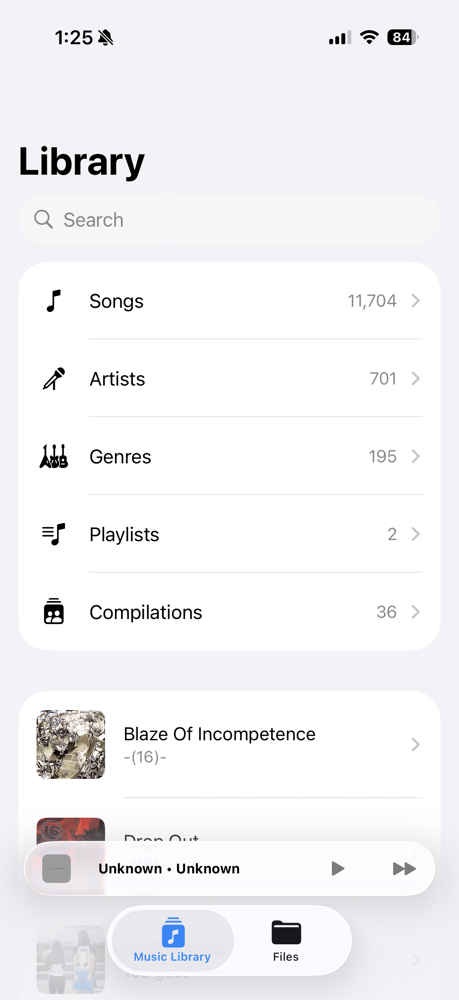
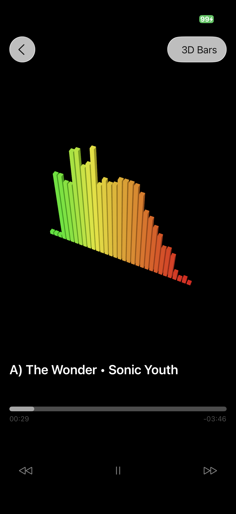

# VisualMan
An audio visualizer/music player app with seven built-in real-time audio visualizers.

## Features
- 7 different beautiful real-time visualizers to choose from
- Access music from the local music library or files directory
- Background playback capabilities

## Technologies
- SwiftUI, Metal and RealityKit for visualizations
- Accelerate and AVFoundation for real-time audio visualization
- MediaPlayer for music library access

## Download
[Download from App Store](https://apps.apple.com/us/app/visualman/id6752315563)
